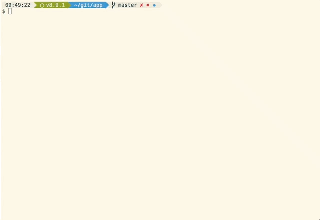
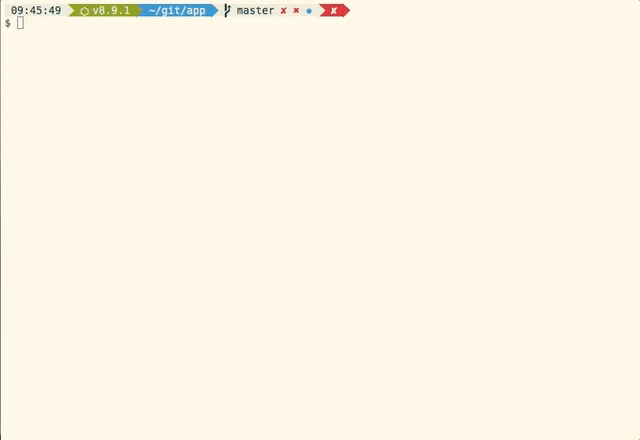
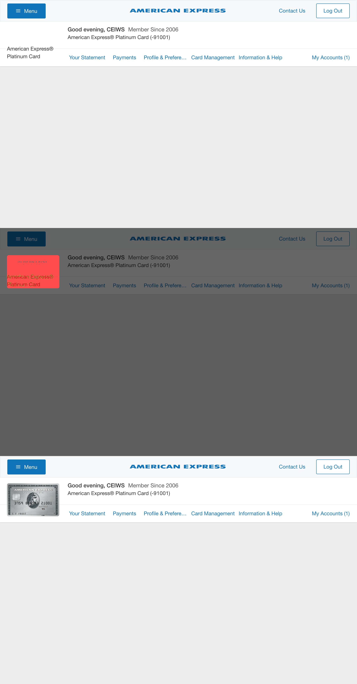

<h1 align="center">
  
</h1>

[](https://www.npmjs.com/package/jest-image-snapshot)
[](https://travis-ci.org/americanexpress/jest-image-snapshot)
[](https://github.com/jest-community/awesome-jest)

> Jest matcher that performs image comparisons using [pixelmatch](https://github.com/mapbox/pixelmatch) and behaves just like [Jest snapshots](https://facebook.github.io/jest/docs/snapshot-testing.html) do! Very useful for visual regression testing.

## 👩‍💻 Hiring 👨‍💻

Want to get paid for your contributions to `jest-image-snapshot`?
> Send your resume to oneamex.careers@aexp.com

## 📖 Table of Contents

* [Features](#-features)
* [Usage](#-usage)
* [API](#-api)
* [Contributing](#-contributing)

## ✨ Features

* Take image snapshots of your application
* Ability to compare snapshots from a baseline
* Update snapshots when you're good with changes
* Customize a difference threshold
* Add a Gaussian blur for noise
* Adjust the diff layout horizontal vs vertical

### How it works

Given an image (Buffer instance with PNG image data) the `toMatchImageSnapshot()` matcher will create a `__image_snapshots__` directory in the directory the test is in and will store the baseline snapshot image there on the first run. Note that if `customSnapshotsDir` option is given then it will store baseline snapshot there instead.

On subsequent test runs the matcher will compare the image being passed against the stored snapshot.

To update the stored image snapshot run Jest with `--updateSnapshot` or `-u` argument. All this works the same way as [Jest snapshots](https://facebook.github.io/jest/docs/snapshot-testing.html).

### See it in action

Typically this matcher is used to for visual tests that run on a browser. For example let's say I finish working on a feature and want to write a test to prevent visual regressions:

```javascript
...
it('renders correctly', async () => {
  const page = await browser.newPage();
  await page.goto('https://localhost:3000');
  const image = await page.screenshot();

  expect(image).toMatchImageSnapshot();
});
...
```



Then after a few days as I finish adding another feature to my component I notice one of my tests failing!



Oh no! I must have introduced a regression! Let's see what the diff looks like to identify what I need to fix:



And now that I know that I broke the card art I can fix it!

Thanks `jest-image-snapshot`, that broken header would not have looked good in production!

## 🤹‍ Usage

### Installation

```bash
npm i --save-dev jest-image-snapshot
```

Please note that `Jest` `>=20 <=25` is a peerDependency. `jest-image-snapshot` will **not** work with anything below Jest 20.x.x

### Invocation

1. Extend Jest's `expect`
```javascript
  const { toMatchImageSnapshot } = require('jest-image-snapshot');

  expect.extend({ toMatchImageSnapshot });
```

2. Use `toMatchImageSnapshot()` in your tests!
```javascript
  it('should demonstrate this matcher`s usage', () => {
    ...
    expect(image).toMatchImageSnapshot();
  });
```

See [the examples](./examples/README.md) for more detailed usage or read about an example use case in the [American Express Technology Blog](https://americanexpress.io/smile-for-the-camera/)

## 🎛️ API

`toMatchImageSnapshot()` takes an optional options object with the following properties:

* `customDiffConfig`: Custom config passed to [pixelmatch](https://github.com/mapbox/pixelmatch#pixelmatchimg1-img2-output-width-height-options) (See options section)
  * By default we have set the `threshold` to 0.01, you can increase that value by passing a customDiffConfig as demonstrated below.
  * Please note the `threshold` set in the `customDiffConfig` is the per pixel sensitivity threshold. For example with a source pixel colour of `#ffffff` (white) and a comparison pixel colour of `#fcfcfc` (really light grey) if you set the threshold to 0 then it would trigger a failure *on that pixel*. However if you were to use say 0.5 then it wouldn't, the colour difference would need to be much more extreme to trigger a failure on that pixel, say `#000000` (black)
* `customSnapshotsDir`: A custom absolute path of a directory to keep this snapshot in
* `customDiffDir`: A custom absolute path of a directory to keep this diff in
* `customSnapshotIdentifier`: A custom name to give this snapshot. If not provided one is computed automatically. When a function is provided it is called with an object containing `testPath`, `currentTestName`, `counter` and `defaultIdentifier` as its first argument. The function must return an identifier to use for the snapshot.
* `diffDirection`: (default: `horizontal`) (options `horizontal` or `vertical`) Changes diff image layout direction
* `noColors`: Removes coloring from console output, useful if storing the results in a file
* `failureThreshold`: (default `0`) Sets the threshold that would trigger a test failure based on the `failureThresholdType` selected. This is different to the `customDiffConfig.threshold` above, that is the per pixel failure threshold, this is the failure threshold for the entire comparison.
* `failureThresholdType`: (default `pixel`) (options `percent` or `pixel`) Sets the type of threshold that would trigger a failure.
* `updatePassedSnapshot`: (default `false`) Updates a snapshot even if it passed the threshold against the existing one.
* `blur`: (default `0`) Applies Gaussian Blur on compared images, accepts radius in pixels as value. Useful when you have noise after scaling images per different resolutions on your target website, usually setting its value to 1-2 should be enough to solve that problem.
* `runInProcess`: (default `false`) Runs the diff in process without spawning a child process.
* `dumpDiffToConsole`: (default `false`) Will output base64 string of a diff image to console in case of failed tests (in addition to creating a diff image). This string can be copy-pasted to a browser address string to preview the diff for a failed test.
* `allowSizeMismatch`: (default `false`) If set to true, the build will not fail when the screenshots to compare have different sizes.

```javascript
it('should demonstrate this matcher`s usage with a custom pixelmatch config', () => {
  ...
  const customConfig = { threshold: 0.5 };
  expect(image).toMatchImageSnapshot({
    customDiffConfig: customConfig,
    customSnapshotIdentifier: 'customSnapshotName',
    noColors: true
  });
});
```

The failure threshold can be set in percent, in this case if the difference is over 1%.

```javascript
it('should fail if there is more than a 1% difference', () => {
  ...
  expect(image).toMatchImageSnapshot({
    failureThreshold: 0.01,
    failureThresholdType: 'percent'
  });
});
```

Custom defaults can be set with a configurable extension. This will allow for customization of this module's defaults. For example, a 0% default threshold can be shared across all tests with the configuration below:

```javascript
const { configureToMatchImageSnapshot } = require('jest-image-snapshot');

const customConfig = { threshold: 0 };
const toMatchImageSnapshot = configureToMatchImageSnapshot({
  customDiffConfig: customConfig,
  noColors: true,
});
expect.extend({ toMatchImageSnapshot });
```

### jest.retryTimes()
Jest supports [automatic retries on test failures](https://jestjs.io/docs/en/jest-object#jestretrytimes). This can be useful for browser screenshot tests which tend to have more frequent false positives. Note that when using jest.retryTimes you'll have to use a unique customSnapshotIdentifier as that's the only way to reliably identify snapshots.

### Recipes

#### Upload diff images from failed tests

[Example Image Upload Test Reporter](examples/image-reporter.js)

If you are using jest-image-snapshot in an ephemeral environment (like a Continuous Integration server) where the file system does not persist, you might want a way to retrieve those images for diagnostics or historical reference. This example shows how to use a custom [Jest Reporter](https://facebook.github.io/jest/docs/en/configuration.html#reporters-array-modulename-modulename-options) that will run after every test, and if there were any images created because they failed the diff test, upload those images to an [AWS S3](https://aws.amazon.com/s3/) bucket.

To enable this image reporter, add it to your `jest.config.js` "reporters" definition:

```javascript
"reporters": [ "default", "<rootDir>/image-reporter.js" ]
```

#### Usage in TypeScript

In TypeScript, you can declare `toMatchImageSnapshot` like this:

```
declare global {
  namespace jest {
    interface Matchers<R> {
      toMatchImageSnapshot(): R
    }
  }
}
```

#### Ignoring parts of the image snapshot if using [Puppeteer](https://github.com/GoogleChrome/puppeteer)

If you want to to ignore parts of the snapshot (for example some banners or other dynamic blocks) you can find DOM elements with Puppeteer and remove/modify them (setting visibility: hidden on block, if removing it breaks your layout, should help):

```javascript
async function removeBanners(page){
  await page.evaluate(() => {
    (document.querySelectorAll('.banner') || []).forEach(el => el.remove());
  });
}

...
it('renders correctly', async () => {
  const page = await browser.newPage();
  await page.goto('https://localhost:3000');

  await removeBanners(page);

  const image = await page.screenshot();

  expect(image).toMatchImageSnapshot();
});
...
```

## 🏆 Contributing

We welcome Your interest in the American Express Open Source Community on Github.
Any Contributor to any Open Source Project managed by the American Express Open
Source Community must accept and sign an Agreement indicating agreement to the
terms below. Except for the rights granted in this Agreement to American Express
and to recipients of software distributed by American Express, You reserve all
right, title, and interest, if any, in and to Your Contributions. Please [fill
out the Agreement](https://cla-assistant.io/americanexpress/jest-image-snapshot).

Please feel free to open pull requests and see [CONTRIBUTING.md](./CONTRIBUTING.md) to learn how to get started contributing.

## 🗝️ License

Any contributions made under this project will be governed by the [Apache License
2.0](https://github.com/americanexpress/jest-image-snapshot/blob/master/LICENSE.txt).

## 🗣️ Code of Conduct

This project adheres to the [American Express Community Guidelines](https://github.com/americanexpress/jest-image-snapshot/wiki/Code-of-Conduct).
By participating, you are expected to honor these guidelines.
