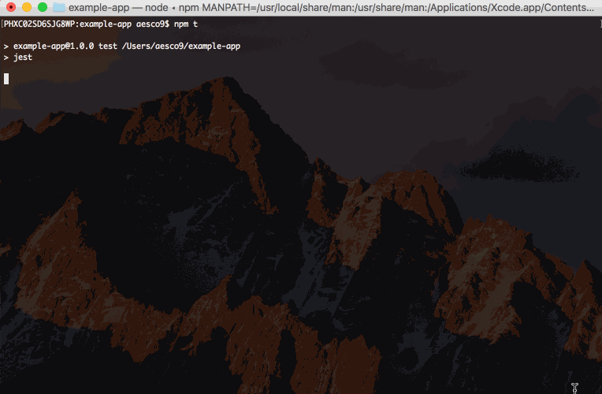
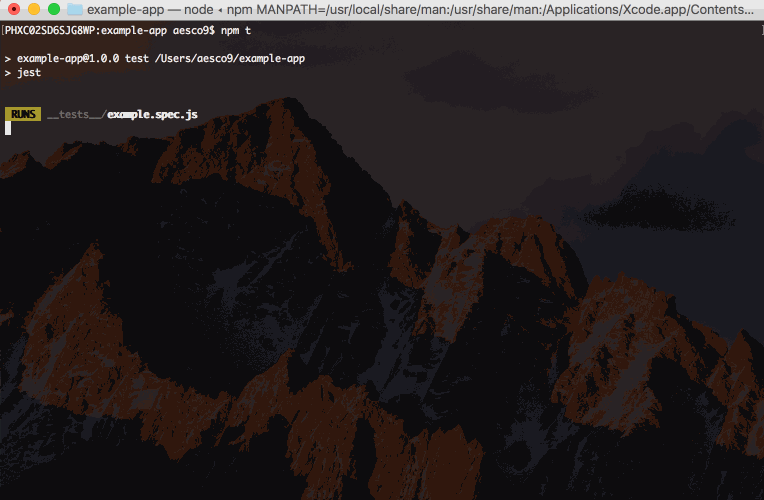

# jest-image-snapshot

[
  ](https://badge.fury.io/js/jest-image-snapshot
) [
  ](https://travis-ci.org/americanexpress/jest-image-snapshot
)

Jest matcher that performs image comparisons using [pixelmatch](https://github.com/mapbox/pixelmatch) and behaves just like [Jest snapshots](https://facebook.github.io/jest/docs/snapshot-testing.html) do! Very useful for browser visual comparison testing.

## Installation:
  ```bash
  npm i --save-dev jest-image-snapshot
  ```

  Please note that `Jest` 20.x.x is a peerDependency. `jest-image-snapshot` will **not** work with anything below jest 20.x.x

## Usage:
1. Extend Jest's `expect`
  ```javascript
    const { toMatchImageSnapshot } = require('jest-image-snapshot');

    expect.extend({ toMatchImageSnapshot });
  ```

2. Use `toMatchImageSnapshot()` in your tests!
  ```javascript
  it('should demonstrate this matcher`s usage', () => {
    ...
    expect(image).toMatchImageSnapshot();
  });
```

### Optional configuration:

`toMatchImageSnapshot()` takes an optional options object with the following properties:

* `customDiffConfig`: Custom config passed [pixelmatch](https://github.com/mapbox/pixelmatch#pixelmatchimg1-img2-output-width-height-options) (See options section)
  * By default we have set the `threshold` to 0.01, you can increase that value by passing a customDiffConfig as demonstrated below.
  * Please note the `threshold` set in the `customDiffConfig` is the per pixel sensitivity threshold. For example with a source pixel colour of `#ffffff` (white) and a comparison pixel colour of `#fcfcfc` (really light grey) if you set the threshold to 0 then it would trigger a failure *on that pixel*. However if you were to use say 0.5 then it wouldn't, the colour difference would need to be much more extreme to trigger a failure on that pixel, say `#000000` (black)
* `customSnapshotsDir`: (default: `__image_snapshots__`) A custom directory to keep this snapshot in
* `customSnapshotIdentifier`: A custom name to give this snapshot. If not provided one is computed automatically
* `noColors`: (default `false`) Removes colouring from console output, useful if storing the results in a file
* `failureThreshold`: (default `0`) Sets the threshold that would trigger a test failure based on the `failureThresholdType` selected. This is different to the `customDiffConfig.threshold` above, that is the per pixel failure threshold, this is the failure threshold for the entire comparison.
* `failureThresholdType`: (default `pixel`) (options `percent` or `pixel`) Sets the type of threshold that would trigger a failure.

```javascript
  it('should demonstrate this matcher`s usage with a custom pixelmatch config', () => {
    ...
    const customConfig = { threshold: 0.5 };
    expect(image).toMatchImageSnapshot({
      customDiffConfig: customConfig,
      customSnapshotIdentifier: 'customSnapshotName',
      noColors: true // the default is false
    });
  });
```

The failure threshold can be set in percent, in this case if the difference is over 1%.

```javascript
  it('should fail if there is more than a 1% difference', () => {
    ...
    expect(image).toMatchImageSnapshot({
      failureThreshold: '0.01',
      failureThresholdType: 'percent'
    });
  });
```

Custom defaults can be set with a configurable extension. This will allow for customization of this module's defaults. For example, a 0% default threshold can be shared across all tests with the configuration below.

```javascript
const { configureToMatchImageSnapshot } = require('jest-image-snapshot');

const customConfig = { threshold: 0 };
const toMatchImageSnapshot = configureToMatchImageSnapshot({
  customDiffConfig: customConfig,
  noColors: true,
})
expect.extend({ toMatchImageSnapshot });
```

## How it works
  Given an image (should be either a PNGImage instance or a Buffer instance with PNG data) the `toMatchImageSnapshot()` matcher will create a `__image_snapshots__` directory in the directory the test is in and will store the baseline snapshot image there on the first run. Note that if `customSnapshotsDir` option is given then it will store baseline snapshot there instead.

  On subsequent test runs the matcher will compare the image being passed against the stored snapshot.

  To update the stored image snapshot run jest with `--updateSnapshot` or `-u` argument. All this works the same way as [Jest snapshots](https://facebook.github.io/jest/docs/snapshot-testing.html).

## See it in action
  Typically this matcher is used to for visual tests that run on a browser. For example let's say I finish working on a feature and want to write a test to prevent visual regressions:
  ```javascript
    it('renders correctly', async () => {
      const browser = await launchChromeHeadless();
      await browser.goTo('https://localhost:3000');
      const screenshot = await browser.takeScreenshot();

      expect(screenshot).toMatchImageSnapshot();
    });
  ```

  

  Then after a few days as I finish adding another feature to my component I notice one of my tests failing!

  

  Oh no! I must have introduced a regression! Let's see what the diff looks like to identify what I need to fix:

  

  And now that I know that I broke the card art I can fix it!

  Thanks `jest-image-snapshot`, that broken header would not have looked good in production!

  ## Contributing
  We welcome Your interest in the American Express Open Source Community on Github.
  Any Contributor to any Open Source Project managed by the American Express Open
  Source Community must accept and sign an Agreement indicating agreement to the
  terms below. Except for the rights granted in this Agreement to American Express
  and to recipients of software distributed by American Express, You reserve all
  right, title, and interest, if any, in and to Your Contributions. Please [fill
  out the Agreement](https://cla-assistant.io/americanexpress/jest-image-snapshot).

  Please feel free to open pull requests and see `CONTRIBUTING.md` for commit formatting details.

  ## License
  Any contributions made under this project will be governed by the [Apache License
  2.0](https://github.com/americanexpress/jest-image-snapshot/blob/master/LICENSE.txt).

  ## Code of Conduct
  This project adheres to the [American Express Community Guidelines](https://github.com/americanexpress/jest-image-snapshot/wiki/Code-of-Conduct).
  By participating, you are expected to honor these guidelines.
